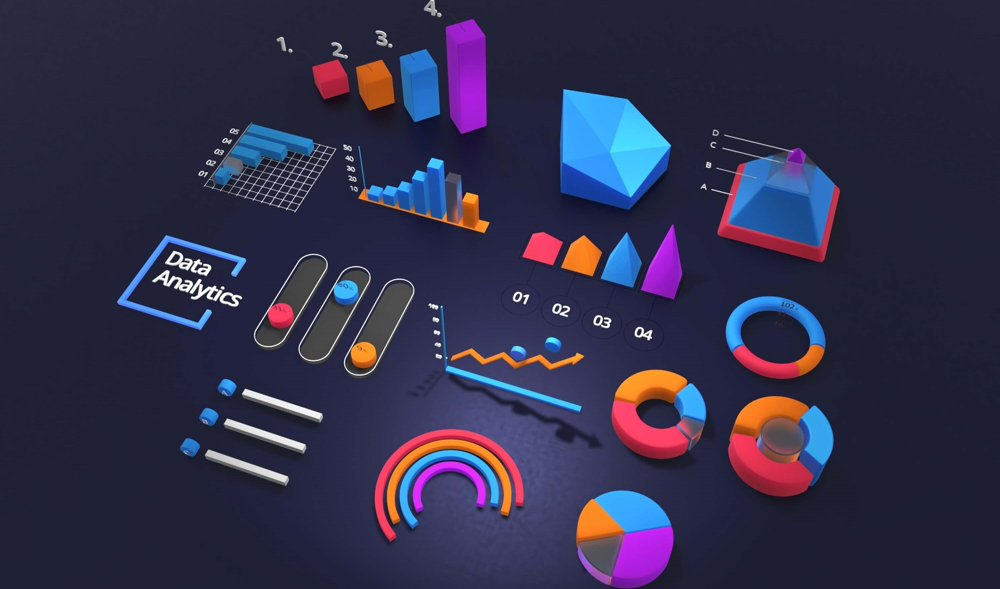

        

# Machine Learning Projects

1.  Rock vs Mine Prediction
    > Logistic Regression | predict rock or mine based on sonar data
2.  Diabetes Prediction
    > Support Vector Machine | predict a person has diabetes or not based on female health dataset that comprises Pregnencies, Glouse, BloodPressure, Insulin, BMI, Age etc.
3.  House Price Prediction
    > XGBoost Regressor | predict house prices based on The Boston housing prices dataset which contains Tax, Age etc.
4.  Fake News Prediction
    > NLP, NLTK, Tfidf, Logistic Regression | predict fake news based on author and title.
5.  Loan Status Prediction
    > Support Vector Machine, Matplotlib, Seaborn (Count Plot) | predict wheather a loan is approved or not based on applicant income, loan amount, credit history, education etc.
6.  Wine Quality Prediction
    > Random Forest, Correlation Matrix, Matplotlib, Seaborn (Cat Plot, Bar Plot) | predict wine quality based on different types of acidity, residual sugar, chlorides, pH, alchohol etc.
7.  Car Price Prediction
    > Linear Regression, Lasso Regression, Matplotlib (Scatter Plot) | estimate pre owned car prices by analysing present price, kilometers driven, fuel type, transmission etc.
8.  Gold Price Prediction
    > Random Forest Regressor, Matplotlib, Seaborn (Heatmap, Distplot/Displot) | predict gold prices from stock value, US oil price, currency pair.
9.  Breast Cancer Classification
    > Tensorflow, Keras, Matplotlib, Neural Network | a neural network approach to classify breast cancer.
10. Heart Disease Diagnosis
    > Logistic Regression, Matplotlib, Seaborn(Count Plot, Heatmap), Correlation Matrix | detect heart disease analysing age, sex, cholesterol, etc.

---

⭐ Don't forget to leave a star  
🎁 Use and share these for educational purpose
